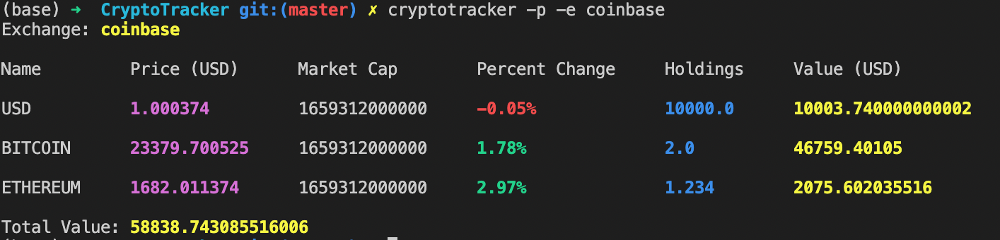

# CryptoTracker

An easy way to setup and manage your crypto currency portfolios from the terminal.

(Using the [CoinGecko](http://coingecko.com/) API)

Compatible with Python 3

## Install

`python setup.py install`

## Usage

### View coin data

`cryptotracker -i bitcoin xrp dash`

### Convert fiat output

`cryptotracker -i bitcoin -c eur`

### Add to portfolio

`cryptotracker --exchange binance -a btc --amt 2000`

`cryptotracker --exchange binance --add ripple --amt 5352`

### Remove from portfolio

`cryptotracker --exchange binance -rm btc`

### View Portfolio

`cryptotracker -p -e binance`

## Screenshot

